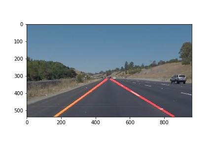

# **Finding Lane Lines on the Road** 

## Reflection

### 1. Description on my pipeline. 

My pipeline consisted of 7 steps.The images obtained in each step are plotted below and the order is from left to right and from up to bottom.


The steps from 2 to 6 are the same as the course introduces, so detailed explanations are ignored.

#### Step 1. Generate the yellow and white mask

The image is first converted to HSL color space as it is more robust than RGB color space. Two color masks (yellow and white) are generated and combined together using bitwise_or(). As we can see on the subfigure, the yellow and white lanes are successfully identified and seperated from the background.


#### Step 2. Apply the mask on the original image


#### Step 3. Converted the images to grayscale


#### Step 4. Apply the gaussian_blur to reduce the noise


#### Step 5. Use canny edge detection to obtain edges


#### Step 6. Apply a region-of-interest mask


#### Step 7. Find hough lines and interpolate the single left and right lanes

In order to draw a single line on the left and right lanes, I modified the draw_lines() function in the following way. First hough lines are divided into lines_left and lines_right according to each line's slope (above zero or not). Then, to make performance check easy, the left line segments are drawn in green color and the right ones are drawn in blue color, which can be seen on the last subfigure above. These green and blue line segements are only added to the image in the test mode (test_flag == 1 in my codes) and  would be removed when the pipeline is tested on the video. Finally, the points in lines_left and lines_right are fitted using linear regression (np.polyfit(x,y,1)) to get two single lines representing the estimated left and right lanes. Theser two lines are drawn on the image in red.


### The results on the tested images are:
| solidWhiteCurve            |  solidWhiteRight  |              solidYellowCurve|
|-------------------------|-------------------------| ------------------------------|
 | |

| solidYellowCurve2            |  solidYellowLeft  | whiteCarLaneSwitch|
|-------------------------|-------------------------| ------------------------------|
 | |  

### 2. Potential shortcomings


One potential shortcoming would be when there is shadow or light change, the algorithm will detect fake hough lines and fail to detect the lanes correctly, as the following two images shows in the challenge video:

 


Another shortcoming could be that the detected lanes are not smooth enough and have oscillations during detection.


### 3. Suggest possible improvements

Improvement for the light change would be to furthur improve the color-mask algorithm (step 1 and step 2) and combine different color filters in different color spaces (RGB, HSL).

The improvement to smoothen the lanes could be to use the information from previous frames and introduce filters (moving average, kalman filter) to obtain more stable estimation of the lanes.


```python

```
